# Packages

This folder contains build artifacts used to deploy to customers. 

The artifacts in this repository are not officially released and may consist of work in progress. Once released, they will be made available in the [GitHub repo](https://github.com/Microsoft/RTW-Rapid-Screening).

## Deployment overview

To deploy the complete Microsoft Rapid Screening Solution, you'll need to follow these steps:

1. **Deploy Return to Workplace Managed Solution:** Download and import the [`returntoworkplace_managed.zip`](https://github.com/microsoft/RTW-Rapid-Screening/raw/PortalV2/Packages/Power-Platform/returntoworkplace_managed.zip) solution.
1. **Create a blank Power Apps Portal**
1. **Deploy RapidScreeningCombined:** Dowload and import the [`ConsortiumMemberGlobal_2_1_0_0.zip`](https://github.com/microsoft/RTW-Rapid-Screening/raw/PortalV2/Packages/Power-Platform/ConsortiumMemberGlobal_2_1_0_0.zip), making sure to use the latest solution version.
1. **Upload Portal Content:** Download [`Rapid-Screening-Portal-Content.zip`](https://github.com/microsoft/RTW-Rapid-Screening/raw/PortalV2/Packages/Power-Platform/Rapid-Screening-Portal-Content.zip) and upload it to the Power Apps Portal.
1. **Configure Solution:** (Optional) Configure the solution using [pre-configured settings](https://github.com/microsoft/RTW-Rapid-Screening/raw/PortalV2/Packages/Power-Platform/Solution-Data/Solution.Config.Data_V5.zip) **or** configure the solution manually. 

## Deploy Return to Workplace Managed Solution

The **Return to Workplace** solution is a managed solution which acts as the foundation for the Microsoft Rapid Screening solution.

To install it, follow these steps:

1. Download the [returntoworkplace_managed](https://github.com/microsoft/RTW-Rapid-Screening/raw/PortalV2/Packages/Power-Platform/returntoworkplace_managed.zip) solution. Do not unzip it.
1.	Go to https://make.powerapps.com/ and login with the same account that was used to create the Power Apps environment
2.	From the **Environment** drop-down, make sure that you have selected the **development** environment. 
    
    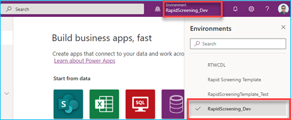
 
3.	From the navigation select **Solutions**.

    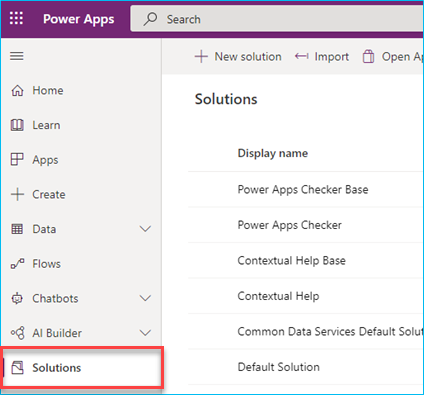
 
4.	From the ribbon menu, select **Import**.

    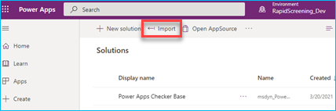
 
5.	Browse and find the `returntoworkplace_managed.zip` solution file downloaded on previous steps and select **Next**.

    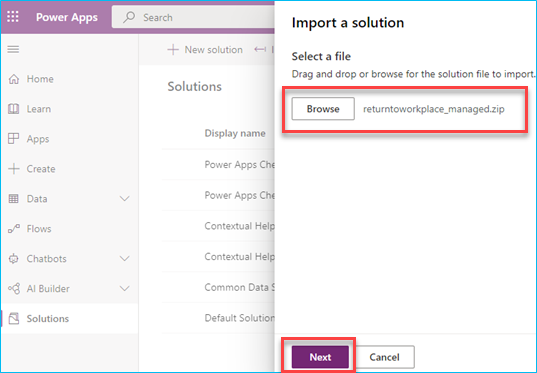

    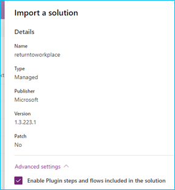

7.	You will be prompted to re-establish connections to active the solution. For each connection listed, select **New Connection** from the drop down (or select if the connection already exists).

    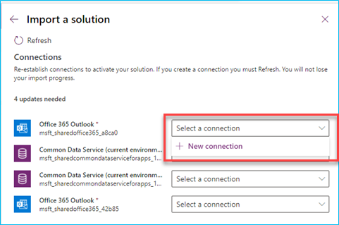
 
8.	This will open a new tab on your browser session, select **Create**.

    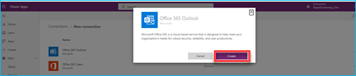
 
9.	Sign in with the service account that you have already signed in with and go through the authentication process.

    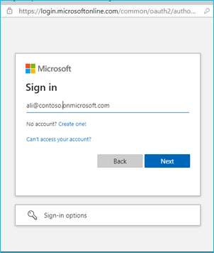

10.	Once the sign-in is completed, you will see a connection created with the service account. Go back to the previous browser tab to continue the creation of the rest of the connections.

    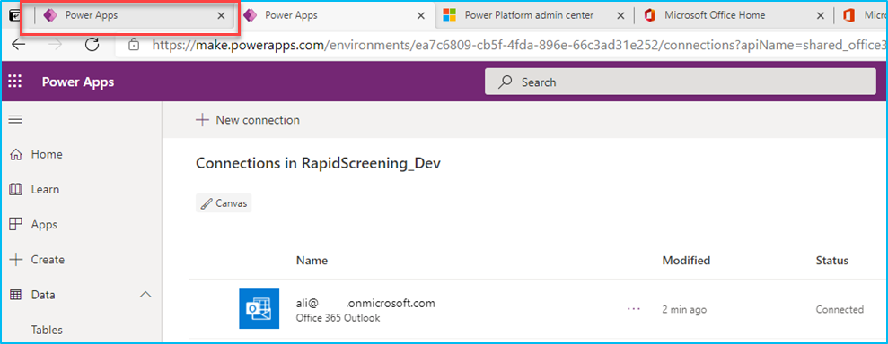
 
11.	On the previous tab, select **Refresh**. This will populate the newly created connection. If it does not,  manually select the connection from the list
 
    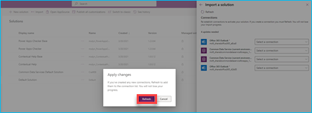

12.	Follow similar steps to create all remaining connections. 
 
    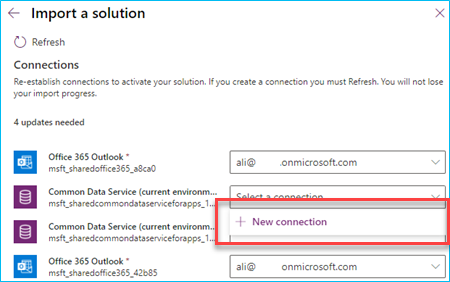

14.	When all connections are created, select **Import**.

    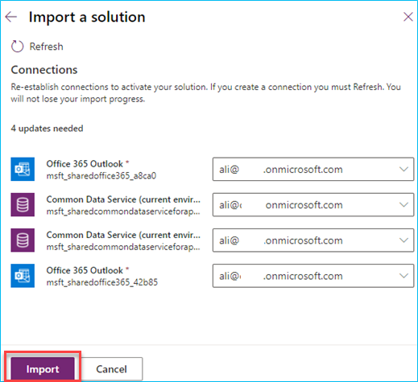
 
15.	The solution import will take between on average 10 to 15 minutes, and you can monitor the import on the solution page. 

    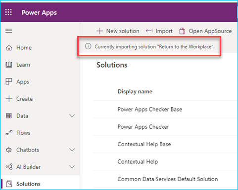
Upd
16.	Once the import is completed you will see a message indicating that the Solution Return to the Workplace imported successfully.

    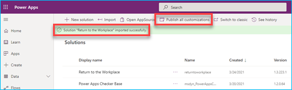
 
17.	Select **Publish all customizations** on the ribbon menu.

    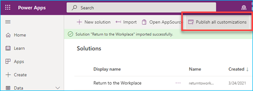
 
18.	From the navigation, select **Apps** and make sure you can see the 3 Microsoft Return to the Workplace apps listed: **Employee Return to the Workplace**, **Facility Safety Management**, and **Workplace Care Management**. If not wait for a few minutes and publish all the customizations again.

    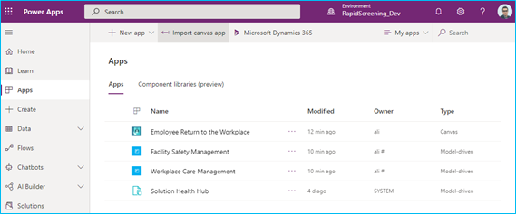

Make sure to wait that all customizations have been published before you proceed to the next step.

## Create a blank Power Apps Portal

In order to successfully import the Rapid Screening Solution, you'll need to have a blank Power Apps Portal instance created. The portal is required -- whether you choose to actively use the portal component or not.

To create a blank portal, follow these steps:

1.  Sign in to [Power Apps](https://make.powerapps.com).  

2.  Under **Make your own app**, select **Portal from blank**.

3.	If the selected environment doesn't contain portal pre-requisites, a message is displayed in the **Portal from blank** window suggesting you select another environment or create a new one.

    

4.	If you choose to continue with the current environment, enter the required information in the window as mentioned in the following steps. If you choose to create a new environment, see [Create new environment](create-additional-portals.md#create-new-environment).

5.  In the **Portal from blank** window, enter a name for the portal and address for the website, and select a language from the drop-down list. When you're done, select **Create**.

      

1. After you select **Create**, the portal will begin provisioning and the provisioning status is displayed through notifications.

1. After the portal is provisioned successfully, the status is updated and the portal is displayed in the grid:

    


## Deploy ConsortiumMemberGlobal

The **Consortium Member Global** solution contains the data model, Power Apps, and Power Automate elements required by the Microsoft Rapid Screening Solution.

To import it, follow these steps:

1. Download the [`ConsortiumMemberGlobal_3_0_0_49.zip`](https://github.com/microsoft/RTW-Rapid-Screening/raw/PortalV2/Packages/Power-Platform/ConsortiumMemberGlobal_3_0_0_49.zip) solution. Do not unzip it.
1. Sign in to [Power Apps](https://make.powerapps.com).  Make sure that you are still in the correct environment (dev).

1. Select **Solutions** from the navigation menu.

    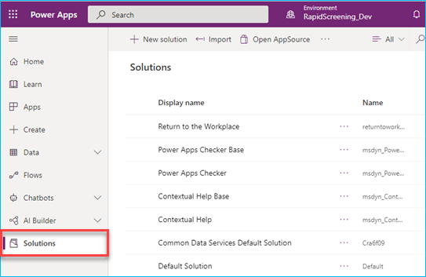

1.	From the ribbon menu, select **Import** and select the `ConsortiumMemberGlobal_3_0_0_49.zip` that you downloaded earlier. Select **Next**. 

    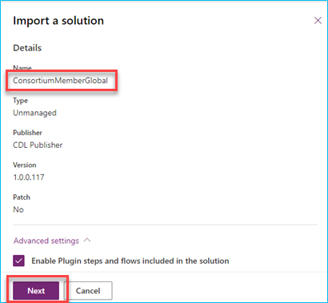
 
1.	Create a **New connection** for each connector as described earlier 

     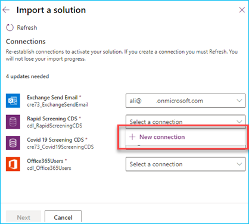

1.	Once all the connections created, select **Next**.
 
     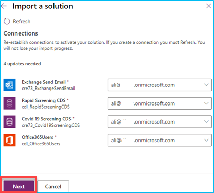

1.	Provide **Admin Email Address** and **Send As Email for Notification Result** email addresses and select **Import**.

     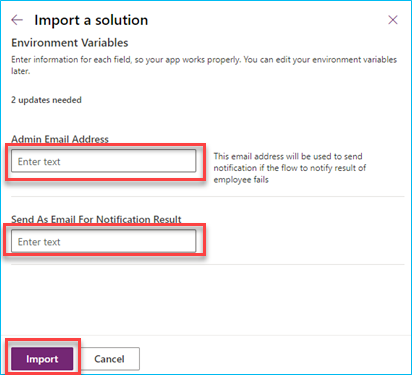

1.	As for the preview import, wait for 10 to 15 minutes for the solution to import successfully. 

     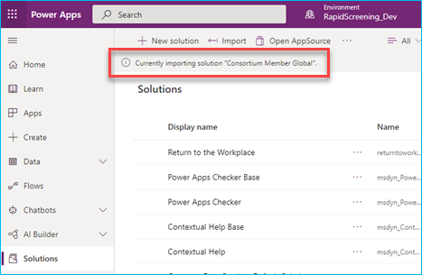
 
1.	Once the solution has been imported successfully, select **Publish all customizations** from the ribbon menu. 
 
     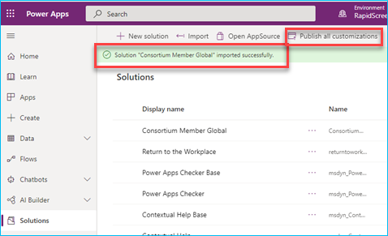

1.	From the navigation, select **Apps** and verify that two new apps were added: **Health Safety Officer Screening App** and **Rapid Screening Booking App**. 
 
     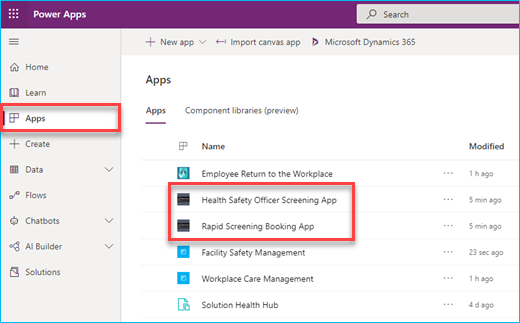


## Upload portal content

The portal content includes all the web pages and resources needed to run the Microsoft Rapid Screening Portal.

To upload the content, you'll need the Power Apps CLI.

If you do not already have the Power Apps CLI installed, do the following:

1. Install [Power Apps CLI](https://aka.ms/PowerAppsCLI).
1. To take advantage of all the latest capabilities, update the Power Apps CLI tooling to the latest version using this command (not applicable for Visual Studio Code Extension):

    ```CLI
    pac install latest
    ```

With the CLI installed, you'll need to connect to the Microsoft Dataverse environment where you created your blank portal and upload content by following these steps:

1. Download the [`Rapid-Screening-Portal=Content.zip`](https://github.com/microsoft/RTW-Rapid-Screening/raw/PortalV2/Packages/Power-Platform/Rapid-Screening-Portal-Content.zip) and unzip it to a local folder.

1. From the command-line, enter the following command, making sure to replace `https://yourenvironment.crm.dynamics.com` with your Dataverse environment URL:

    ```powershell
    pac auth create -u https://yourenvironment.crm.dynamics.com
    ```

1. From the command-line, enter the following command, making sure to replace the `c:\yourpathhere` to point to the location where you extracted the `.zip` file in the previous step.

    ```powershell
    pac paportal upload --path c:\yourpathhere
    ```

1. It may take 10 to 15 minutes to complete this step.

Once the portal content is uploaded, your blank portal will now contain the Micrososft Rapid Screening Portal. 


## Configure solution

In order to use the Microsoft Rapid Screening solution, you'll need to configure it and provide areas, facilities, facility groups, facility types, re-open phases, solution settings, provinces/states, countries, email templates, self-screening videos, and theme guides.

Luckily, you can get started by using the Solution Configuration Data the pre-populate sample data for you. You can then change the data to suit your specific needs.

To install the configuration data, follow these steps:

1. Download the [Solution.Config.Data_V5.zip](https://github.com/microsoft/RTW-Rapid-Screening/raw/PortalV1/Packages/Power-Platform/Solution-Data/Solution.Config.Data_V5.zip) file. There is no need to unzip the content.
1. Download the content of the [ConfigurationMigrationTool folder](https://github.com/microsoft/RTW-Rapid-Screening/tree/PortalV1/Packages/Power-Platform/Solution-Data/ConfigurationMigrationTool) or [download the tool from NuGet](https://docs.microsoft.com/en-us/dynamics365/customerengagement/on-premises/developer/download-tools-nuget?view=op-9-1).
1. Once installed, launch the `DataMigrationUtility.exe`. This is a small utility that helps with data migration. 
1. When prompted **What would you like to do with the Common Data Service Configuration Migration?**, select **Import data**, followed by **Continue**.

    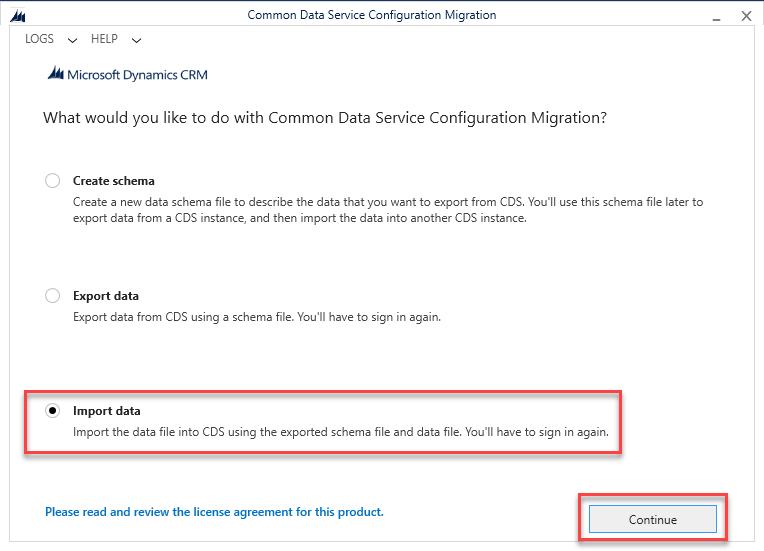
1. In the **Login** screen, select **Office 365**, followed by **Login**.

    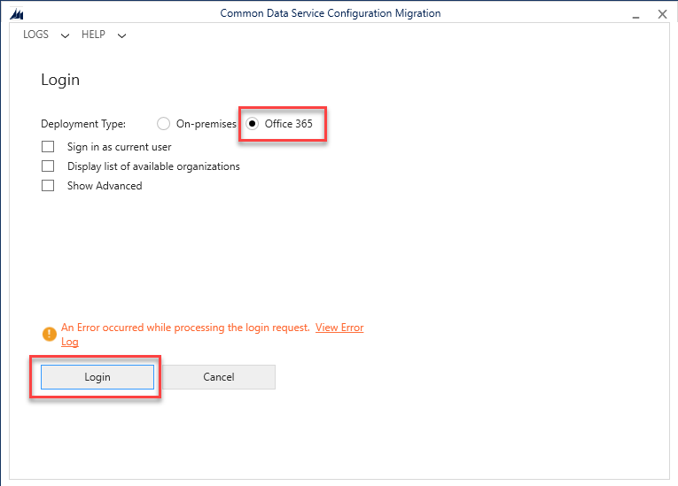
1. Once logged in, select the correct environment from the list, followed by **Login**.

    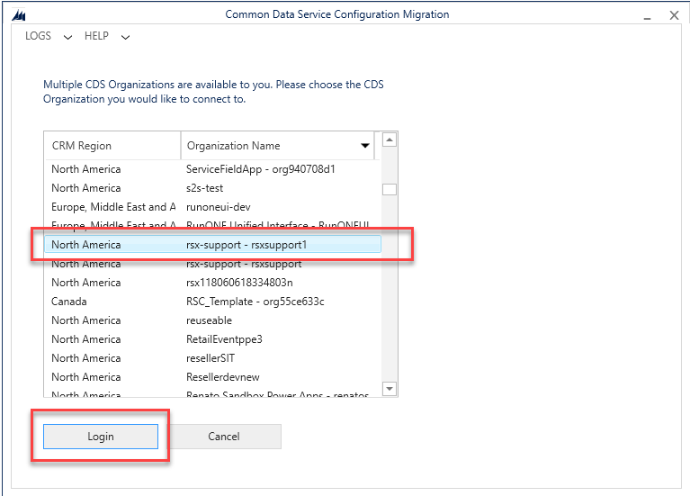
 
1.	When prompted for a **Zip File**, select the `.zip` file named `Solution.Config.Data_V5.zip`, followed by **Import Data**

    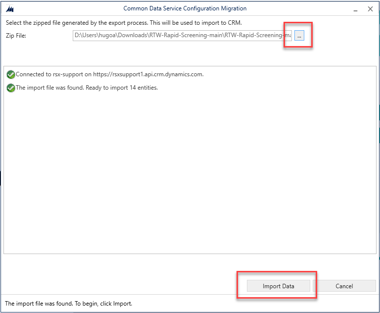

1. The utility will list all steps performed. This may take a few minutes.
    
    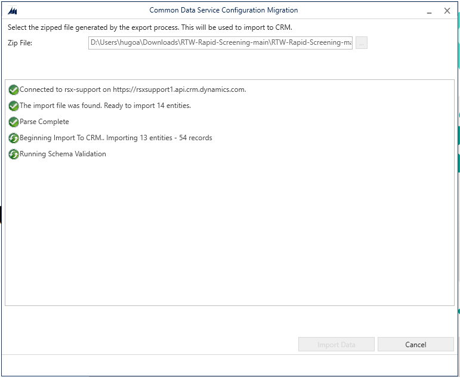
    
1.	Close the application once the import is completed by selecting **Exit**.
 
    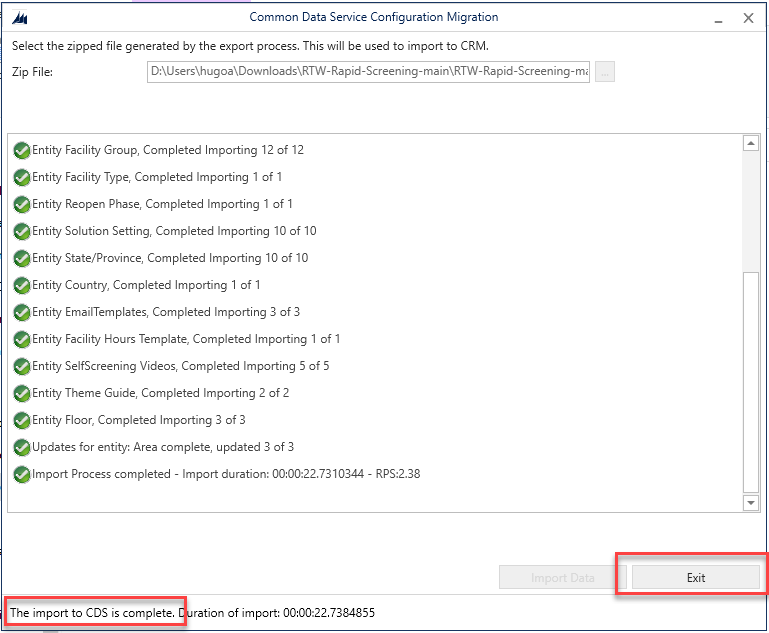
)
